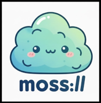
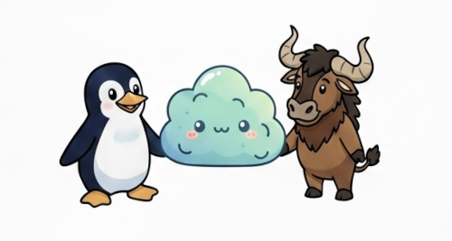
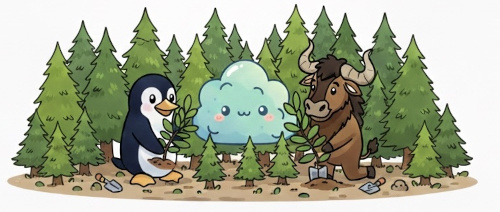
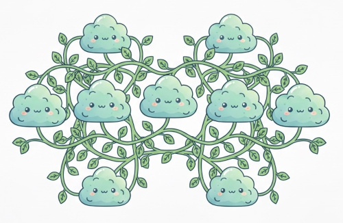
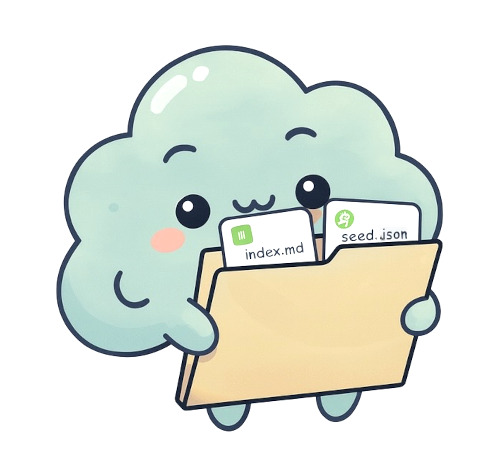
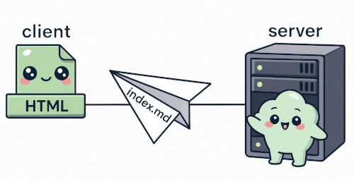
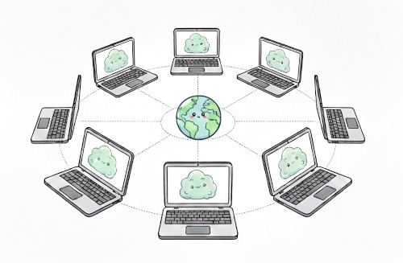
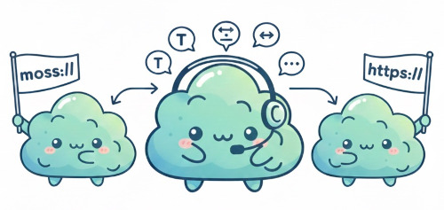

# Welcome to the Moss Network

## **A new old Internet**

Moss is an effort to reclaim a more human, simple, and sustainable Internet. It is neither a platform nor a new protocol, but rather a content-distribution layer built on top of the existing Web and grounded in a no-so-old and no-so-radical idea: human knowledge can circulate freely, lightly, and without centralization when published as open, plain-text documents.

A Moss node is simply a folder containing Markdown files and a small identity file. From this technical minimalism emerges an ecosystem that prioritizes autonomy, computational sustainability, transparency, mindful reading, and a form of decentralization rooted in editorial practice rather than infrastructure. Moss works on modest servers, local networks, USB drives, Git repositories, or even completely offline; its philosophy resists unnecessary complexity, tracking, or algorithmic manipulation, and instead promotes a deliberate, reader-centric digital environment.

In Moss, files can disappear, be copied, or be re-seeded anywhere without losing their essence. The real peer-to-peer network is the human layer: individuals who write, link, curate, and replicate content through voluntary action. This creates a web of connections that survives because it is understandable, portable, and easy to rebuild.

If you seek a Web that is lighter, clearer, and more respectful of attention, Moss offers an open invitation to publish with intention and to help cultivate a digital space that grows like a sustainable garden.
---

## **The Moss philosophy**

The core values of the Moss ecosystem prioritize autonomy, simplicity and sustainability.

### **▼ Autonomy**

Autonomy is the core of Moss (a commitment to digital freedom that echoes the foundational values of the GNU/Linux and Free and Open Source Software or FOSS movements). Anyone, regardless of technical skill or resources, can create and run a Moss node because the system is designed to be simple, transparent, and accessible.

* **Freedom to create and share:** Moss empowers individuals to publish and curate their own content without gatekeepers or intermediaries. This freedom reflects the FOSS ideal that users should have full control over their digital environment and the software they rely on.

* **Minimal technical barriers:** All that’s required is a basic directory served over HTTP (a ubiquitous, open standard supported by countless servers worldwide). This simplicity removes unnecessary complexity, fostering inclusion and encouraging experimentation, just as GNU/Linux made computing accessible beyond proprietary constraints.

* **Full ownership and control:** Content hosted on Moss nodes belongs entirely to the publisher. No centralized platforms claim rights or impose restrictions, mirroring the FOSS commitment to user sovereignty and the rejection of proprietary lock-in. Moreover, authors retain complete freedom to choose the license under which their content is shared (whether permissive, copyleft, or custom), ensuring that their work is protected and distributed according to their own terms.

* **Decentralization and resilience:** Moss operates without dependence on centralized services, complex APIs, or corporate-controlled infrastructures. This decentralization ensures resilience, privacy, and a more democratic digital ecosystem, much like how Linux distributions and open protocols avoid monopolies and encourage collaborative stewardship.

In essence, Moss is more than a content distribution layer. It’s a movement that embodies the spirit of digital emancipation, where technology serves people’s autonomy rather than controlling it. There are no hidden layers, proprietary formats, or black-box systems. What you see is exactly what is served.

### **▼ Simplicity**

Moss encourages a calm and mindful approach to online interaction:

* There are no endless scrolling feeds, no manipulative algorithms, and no constant noise demanding your attention.
* Instead, Moss offers an intentional space for reading, reflection, and creating meaningful, respectful connections between ideas.

Additionally, Moss is **offline-first by design**. You can browse Moss either connected to the global network or completely offline. A single Moss node can be created, explored, and used entirely within a local file system (whether on your computer, a USB drive, or a local server). It functions like a network of linked files, similar to an Obsidian vault, meaning it works perfectly without any internet connection. Plus, the content of Moss nodes can be easily downloaded and re-shared, making the Moss network highly replicable and ideal for off-the-grid communities.

This simplicity also makes Moss well-suited for educational settings:

* **Children-friendly:** While early childhood is best spent screen-free, Moss provides a safe and focused entry point for older children seeking educational content on electronic devices. Its simple, text-based format, free from external tracking or intrusive scripts, creates a secure environment for young readers. Moreover, local or offline Moss networks can be configured to ensure **curated content**, giving educators and parents full control over what is accessible.

### **▼ Sustainability**

Moss embodies the philosophy of **permacomputing** (a sustainable approach to digital technology inspired by permaculture principles, which emphasize harmony with natural ecosystems, minimal resource consumption, and long-term resilience). Just as mosses and lichens form foundational layers in natural environments (slow-growing, low-impact organisms that create fertile ground for diverse life), Moss aims to create a lightweight, enduring, and nurturing digital ecosystem.

* Moss content is inherently light and unobtrusive:

  * It consists purely of Markdown text (with optional images), ensuring simplicity and ease of access.
  * It avoids heavy scripts, bloated frameworks, and external dependencies that drain bandwidth or demand excessive processing power.
  * This makes Moss nodes perfectly suited to run on modest, even aging servers or low-powered devices, minimizing energy consumption and reducing the environmental footprint of digital publishing.

At its core, Moss embraces **fluidity and resilience within the human layer** of peer-to-peer (P2P) interactions.

* **No reliance on algorithmic permanence:** Moss does not depend on distributed ledgers, consensus algorithms, or blockchain technologies to ensure content permanence with high environmental costs. There is no technical requirement for nodes to remain continuously online or synchronized, allowing for a natural flow of participation.

* **Human-centric P2P network:** The real strength of Moss lies in its people. Each Moss node is maintained by individuals who choose to publish, share, and link content freely. If a node disappears, the knowledge and ideas endure because the content is stored in plain Markdown text, easily copied, adapted, and republished by others. This **voluntary replication and editorial linking** ensures that information is preserved and propagated organically.

* **Tolerance and adaptability:** Like moss growing on different surfaces or lichens thriving in diverse conditions, a Moss node can vanish, move, or be *re-seeded* on new servers without disrupting the wider ecosystem. The vitality of Moss resides not in the physical server or complex technology, but in the text itself, its intrinsic value, and the human connections that weave the network together.

Through this metaphor and design philosophy, Moss fosters a digital ecosystem that is sustainable, resilient, and deeply human (a gentle layer that supports a flourishing web of knowledge without demanding excess, controlling mechanisms, or rigid permanence).

## **What is a Moss node?**

A Moss node is simply a **directory** (a folder) that contains:

* Multiple content documents (`.md` files).
* A minimal configuration file (`seed.json`) defining basic identity and menu structure.
* Its own unique set of internal links and external links to other Moss nodes.

## **The Moss client (`index.html`)**

The HTML file you are currently rendering in your browser (`index.html`) is actually a lightweight client that enables the navigation of this text-based forest. It acts as the minimal interpreter for the Moss layer:

* **Markdown Focused:** It uses libraries like `marked.js` to read and render Markdown content (`.md`) into clean, semantic HTML.
* **Node Awareness:** It reads the required `seed.json` file to establish the node's identity (e.g., `moss://xmunch.com`) and populate the dynamic sidebar navigation.
* **User Control:** It includes controls for light/dark theme toggling and adjustable font size, putting a minimal aesthetic control in the hands of the reader.
* **Minimalist Design:** Its aesthetic is clean, distraction-free, and respects the attention of the reader. It is designed to accompany you, **not to capture your attention or retain your presence.**

## **The Moss network**

The Moss Network is **not** an infrastructure or a specific technical layer. It is the cumulative result of a shared practice:

* Individuals publishing simple, human-readable content.
* Standard web servers hosting folders of plain text.
* Hyperlinks connecting related ideas and concepts.
* Nodes emerging, evolving, or departing naturally over time.

Decentralization in Moss is rooted in the **editorial practice** (the choice to publish simply) not in complex technical architecture.

---

## How does it work?

The client (the application reading the Moss node, such as this `index.html` viewer) is programmed with one essential instruction: **"Translate `moss://` and manage the file path."**

This allows Moss to use simple links without relying on complex technical promises:

1.  **External Links (To Other Moss Nodes):**
    A link pointing to another part of the ecosystem, such as `[Another Node](moss://other.domain/index.md)`, is automatically rewritten by the client into a standard web request for `https://other.domain/index.md`. The standard web server only sees the usual HTTP/HTTPS request.

2.  **Internal Links (Local Node Files):**
    To maintain consistency and portability within your own node, links to your local files (e.g., `[About](/about.md)`) are interpreted **relative to your own `moss://` address**. The translation layer ensures that the request sent to the server is correct: `https://[Your Moss Address]/about.md`.

In this way, `moss://` acts as a **conceptual alias** that confirms the content follows the Moss philosophy, but the data transfer is performed efficiently and reliably using the already existing `http/https` infrastructure.

---

## **How to publish your own Moss Node**

1.  Create a folder/directory in your computer.
2.  Use a text editor to create your main document (`index.md`). 
3.  Begin writing in Markdown format ([if you don't know how Markdown works, check this basic tutorial](markdown.md)).
4.  Add links to your file. If you link to other local files in the same folder, just use the relative path (eg. `about.md` or `pages/about.md`, etc..). If you link to external Moss nodes remember to use `moss://` when adding the link.
5.  Add a `seed.json` file to establish your node's identity and menu structure.
6. Upload the folder to your server, Github repo, Raspberry Pi [...] or one of the free [Moss public hosting](hosting.md) services. 
7. Send us an email sharing your repo URL, so we include you in the official registry of Moss sites :)
8. You are now part of the Moss ecosystem!

---

## **An Invitation**

Moss is a small, conscious gesture.
It is a form of gentle resistance against the centralized, attention-hungry Web. It is a quiet reminder that hypertext can still be a deeply human space.

If this idea resonates with you, if you wish to publish without noise, and if you desire the Web to feel like a sustainable garden once more.

---